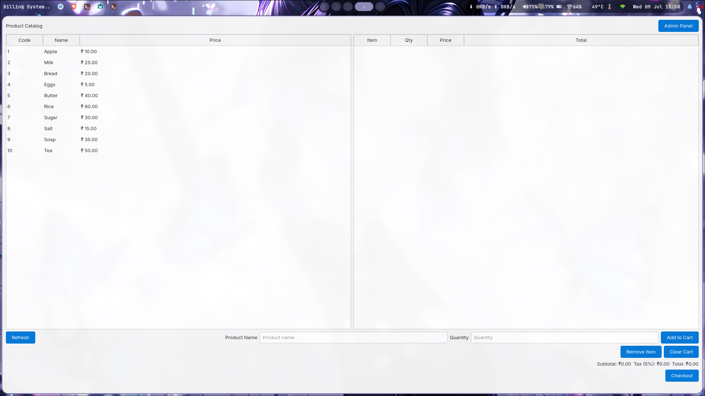

# 📟 Billing-System (Qt C++)

A simple supermarket billing system with a GUI built using **Qt** and **C++**. This app allows a cashier to select products, calculate totals (including tax), and manage a cart-based billing flow with real-time product search, an admin panel, and a database-driven catalog.



## ✨ Features

- Product catalog loaded from **SQLite** database
- Add items to cart by entering **product name** with auto-suggestions
- **Admin Panel** to add and delete products from the database
- Auto-calculates subtotal, tax (5%), and total
- Displays itemized bill with price and quantity
- Clean Qt-based user interface (QTableWidgets, QLabel, QPushButton, etc.)

---

## 🛠️ Tech Stack

- **Language**: C++
- **Framework**: Qt 6 / Qt 5 (QtWidgets)
- **Database**: SQLite
- **IDE**: Qt Creator

---

## 📁 Project Structure

```bash
Billing-System/
├── main.cpp
├── mainwindow.cpp
├── mainwindow.h
├── mainwindow.ui
├── adminwindow.cpp
├── adminwindow.h
├── adminwindow.ui
├── products.db
├── Billing-System.pro
└── README.md
```

## 🚀 Getting Started
Clone the Repository

```bash
Copy
Edit
git clone https://github.com/Nivedck/Billing-System.git
cd Billing-System
```
2. **Open in Qt Creator**

 - Open `Billing-System.pro` in **Qt Creator**

 - Build and Run the project

**Database**

A sample products.db file is included

Use the Admin Panel to manage the catalog

---

## 🛒 Demo Product Catalog

| Code | Product | Price (₹) |
|------|---------|-----------|
| 101  | Apple   | 10.00     |
| 102  | Milk    | 25.00     |
| 103  | Bread   | 20.00     |
| 104  | Eggs    | 5.00      |
| 105  | Butter  | 40.00     |
| 106  | Rice    | 60.00     |
| 107  | Sugar   | 30.00     |
| 108  | Salt    | 15.00     |
| 109  | Soap    | 35.00     |
| 110  | Tea     | 50.00     |

---


##✅ To Do

 - Basic UI and logic   ✅

 - Connect to database (SQLite)  ✅

 - Admin Panel to manage products ✅

 - Product search with suggestions ✅

 - Remove item from cart

 - Save/print bill

 - Add barcode scanner support


📄 License
MIT License

