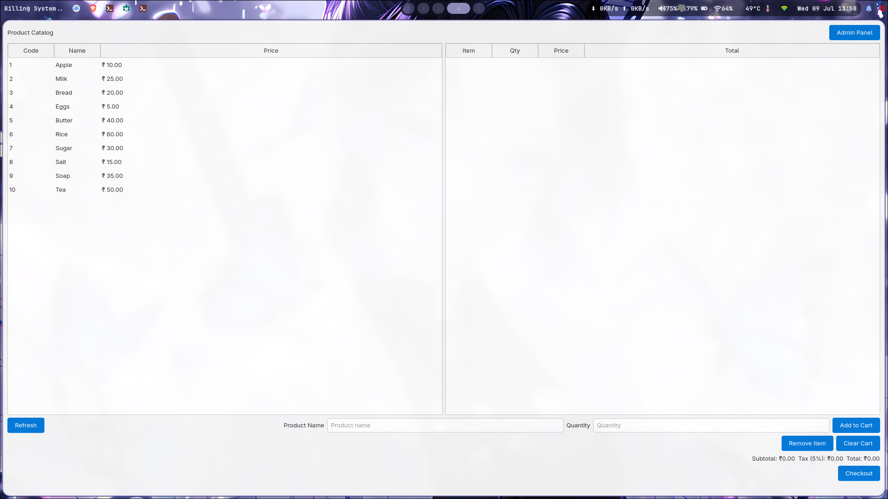

# 📟 Billing-System (Qt C++)

A simple supermarket billing system with a GUI built using **Qt** and **C++**. This app allows a cashier to select products, calculate totals (including tax), and manage a cart-based billing flow.



## ✨ Features

- Predefined product catalog (hardcoded, can be expanded later)
- Add items to cart by entering product code and quantity
- Auto-calculates subtotal, tax (5%), and total
- Displays itemized bill with price and quantity
- Clean Qt-based user interface (QTableWidgets, QLabel, QPushButton, etc.)

---

## 🛠️ Tech Stack

- **Language**: C++
- **Framework**: Qt 6 / Qt 5 (QtWidgets)
- **IDE**: Qt Creator

---

## 📁 Project Structure

```bash
Billing-System/
├── main.cpp
├── mainwindow.cpp
├── mainwindow.h
├── mainwindow.ui
├── Billing-System.pro
└── README.md
```

---

## 🚀 Getting Started

1. **Clone the Repository**

```bash
git clone https://github.com/Nivedck/Billing-System.git
cd Billing-System
```

2. **Open in Qt Creator**

- Open `Billing-System.pro` in **Qt Creator**
- Build and Run the project

---

## 🛒 Demo Product Catalog

| Code | Product | Price (₹) |
|------|---------|-----------|
| 101  | Apple   | 10.00     |
| 102  | Milk    | 25.00     |
| 103  | Bread   | 20.00     |
| 104  | Eggs    | 5.00      |
| 105  | Butter  | 40.00     |
| 106  | Rice    | 60.00     |
| 107  | Sugar   | 30.00     |
| 108  | Salt    | 15.00     |
| 109  | Soap    | 35.00     |
| 110  | Tea     | 50.00     |

---

## ✅ To Do

- [x] Basic UI and logic
- [ ] Remove item from cart
- [ ] Save/print bill
- [ ] Connect to database (SQLite)
- [ ] Add barcode scanner support

---

## 📸 Screenshots

> You can add a full screenshot of the app UI here.

---

## 📄 License

MIT License

---

Made with 💻 by [Nivedck](https://github.com/Nivedck)

